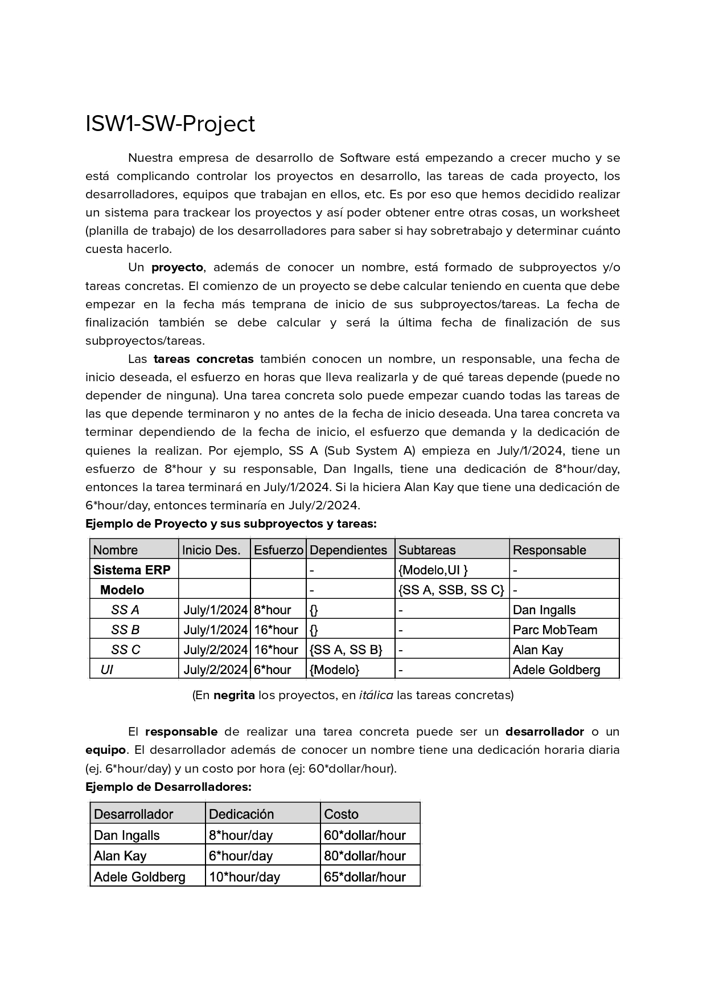

# ProjectTracker
Sistema para la gestión de proyectos y obtención de métricas de los equipos de trabajo y desarolladores. Parcial de POO y patrones de diseño adaptado a GO con TDD y Testify. Originalmente se resolvía con Smalltalk para la materia Ingeniería de Software I.

## Sources
- Parciales de la materia: https://github.com/UBA-FCEN-IngSoft1/Parciales
- Materia: [Ingeniería de Software I, Facultad de Ciencias Exactas y Naturales, Universidad de Buenos Aires]( https://www.isw2.com.ar/)
- Profesor: [Hernán Wilkinson](https://x.com/HernanWilkinson)

## Structure

## Requirements

